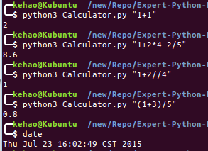

题目：
---
1. 编写一个简单的计算器程序，从命令行第一个参数中获取包含若干个整数和加减乘除运算符的字符串，不考虑空格、括号或异常情况，解析并将计算结果输出。要求最终代码是可运行的模块，并以.py脚本的形式提交到网络学堂中。

解答：
--
使用了python函数 eval(expression, globals=None, locals=None)直接将输入的表达式作为命令解释执行，然后输出。

运行截图
----

